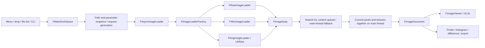

English | [简体中文](ARCHITECTURE.zh-CN.md)

# YUVRaw architecture

YUVRaw is a Windows desktop application built with C++17 / MSVC v145. GLFW manages windows, Dear ImGui docking supplies the interface, and rendering requests OpenGL 3.3 core at minimum. GLAD exposes additional APIs; this does not mean the application requires OpenGL 4.6. Build through `YUVRaw.sln`; the vcpkg manifest and source lock pin dependency versions and recipes.

## Module responsibilities

| Directory / module | Responsibility |
|---|---|
| `Application.cpp`, `Core/FApplication` | WinMain, lifetime, event loop, drag-and-drop entry, explicit shutdown |
| `Core/FWindow`, `FRenderer`, `FUiResources` | GLFW/GL contexts, ImGui, fonts/DPI, frame rendering; executable-relative assets and user-directory layout persistence |
| `Core/FLocalization`, `FUiText.inl` | Shared English/Chinese UI resources and stable translated window IDs; English is the default |
| `Core/FMainDockSpace` | Panel layout, coordination of main/comparison/difference images, shortcuts, and user-intent routing |
| `Core/FImageDocument` | One image's path, loading parameters, display settings, CPU pixels, and GPU texture |
| `Core/FAsyncImageLoader`, `FAsyncJob` | Bounded asynchronous loading, background difference/export, main-thread result commit |
| `Core/FUserSettings`, `FImageConfigCache` | Persistent settings and bounded image-property LRU; `FDirectoryImagePropertyHistory` stores session-only directory preferences |
| `Image/FImageFormatDesc` | Descriptors for formats, plane geometry, stride, bit depth, sampling layout, and editable properties |
| `Image/FRawImageLoader` | First-frame reads of headerless RGB/grayscale/YUV/Bayer, packed RAW unpacking, and endian conversion |
| `Image/FWicImageLoader`, `FDngImageLoader` | First-frame standard-image decoding and LibRaw DNG decoding |
| `Image/FImageLimits` | Dimensions, pixel counts, frame byte limits, and overflow-safe arithmetic |
| `Image/FColorTransform`, `FImageSampler` | CPU color reference, pixel probe, and RGB8 conversion |
| `Image/FImageCompare`, `FImageExporter`, `FWebpEncoder` | Differences/statistics, SDR RGB8 export, and in-project lossless VP8L encoding |
| `UI/` | File browser, viewer, properties, histogram, comparison, export, themes, icons, and tooltips |
| `gl/FTexture`, `FTextureData` | Single-texture resources and descriptor-driven multiplane texture creation/upload |
| `gl/FShader`, `FShaderManager`, `FShaders.h` | GLSL source and cached compilation on first format use |
| `Core/FHdrDisplay`, `FHdrPresenter` | Display HDR capabilities, GL/D3D11 interoperability, and scRGB presentation |
| `tests/`, `tools/` | Public regression, release validation, source and license delivery |

The directory on disk is `src/gl/`; existing project references to `src\GL\` resolve to the same location on Windows.

## From file opening to display

Self-describing images prioritize headers. Headerless inputs combine explicit parameters, image cache, directory preferences, and filename candidates; all entry points share resolution rules. The file list may replace the image in the current comparison slot; menus, recent files, and system drops always open the main image.

The loading mailbox keeps one running request and one latest pending request. Each new request increments the generation so stale decoding cannot replace a newer image. Background upload creates new textures, issues a fence and flush in the shared context, and hands them to the main thread for zero-wait polling. Mismatched function tables or unavailable shared contexts fall back to background decoding with main-thread upload. CPU pixels and textures change together; the previous image remains visible during loading.

Background difference and export jobs read current document pixels. Operations that change documents are restricted while these jobs run, and new loading results are committed later. Workers never operate on ImGui or panel objects.

## Formats and color

`FImageFormatDesc` drives frame sizes, plane geometry, texture formats, shader selection, and Properties. Append new enum values to preserve persisted numeric values; UI ordering is independent. Loading unpacks packed RAW into internal Bayer16 and handles endian conversion.

YCbCr matrix, primaries, and transfer function are independent and must not be inferred from bit depth. CPU `FColorTransform` and GLSL `FShaders.h` use the same sequence for conversion, exposure, tone mapping, and out-of-range display. Probe, histogram, difference, and export share CPU interpretation. Bayer contains sensor-linear samples and follows a separate basic preview path. LibRaw processes DNG metadata into sRGB RGBA8.

Export interprets source pixels, converts to RGB8, resamples with preserved aspect ratio, then encodes. Downscaling uses area averaging; upscaling uses bilinear interpolation. Current-image export reads the loaded data and settings; batch export loads files individually. Output is SDR RGB8 without input alpha, sensor bit depth, or HDR metadata.

## HDR and resource lifetime

The HDR main window composites an entire frame into an fp16 FBO, shares its texture with D3D11 through `WGL_NV_DX_interop2`, and presents through an scRGB swap chain. Presentation, display capabilities, and the user's HDR preference are managed separately. Failure falls back to SDR; detached ImGui viewports also use SDR. Actual HDR correctness requires compatible hardware; fp16 GPU numerical tests cannot substitute for display acceptance.

The application shuts down explicitly: stop background loading and wait for jobs → destroy documents/DockSpace → clear shaders → clear loaders → destroy Renderer/HDR/ImGui → destroy the main window/GLFW → close logging. Destroy GL resources while their contexts remain valid; do not depend on implicit static-object destruction order.

## Extension and validation

- New format: append its enum and descriptor, add CPU geometry/sampling and GPU format tests, and extend the factory only if a new file decoder is needed.
- New panel: define its document target and callback boundary; register both language resources and use the same stable window ID for its title and DockBuilder key.
- Color changes: update CPU and GLSL together; run color-reference and fp16 GPU comparisons.
- New source: explicitly update `.vcxproj`, `.filters`, and the source-distribution allowlist.

Full commands are in [building and testing](docs/BUILDING.md). Internal guidance lives in `.agents/skills/yuvraw/references/`; the public development workflow requires no AI tools.
