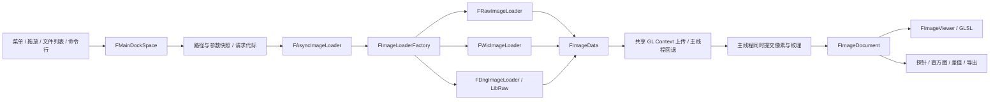

[English](ARCHITECTURE.md) | 简体中文

# YUVRaw 架构

YUVRaw 是 C++17 / MSVC v145 的 Windows 桌面程序。窗口由 GLFW 管理，界面使用 Dear ImGui docking，渲染最低请求 OpenGL 3.3 core。GLAD 生成文件暴露更多 API，不代表应用要求 OpenGL 4.6。构建入口是 `YUVRaw.sln`，依赖版本和配方由 vcpkg 清单及源码锁固定。

## 模块职责

| 目录 / 模块 | 职责 |
|---|---|
| `Application.cpp`、`Core/FApplication` | WinMain、生命周期、事件循环、拖放入口、显式关闭 |
| `Core/FWindow`、`FRenderer`、`FUiResources` | GLFW/GL 上下文、ImGui、字体/DPI、帧渲染；基于程序目录的资源定位与用户目录的布局持久化 |
| `Core/FLocalization`、`FUiText.inl` | 中英文 UI 资源与翻译无关的固定窗口 ID；默认英文 |
| Core/FMainDockSpace | 面板布局、主图/对比图/差值图协调、快捷键与用户意图路由 |
| `Core/FImageDocument` | 单幅图的路径、加载参数、显示设置、CPU 像素与 GPU 纹理 |
| `Core/FAsyncImageLoader`、`FAsyncJob` | 有界异步加载，后台差值/导出，主线程提交结果 |
| `Core/FUserSettings`、`FImageConfigCache` | 跨会话设置及有界图片属性 LRU；`FDirectoryImagePropertyHistory` 只保存当前会话目录偏好 |
| `Image/FImageFormatDesc` | 格式、平面几何、stride、位深、采样布局、可编辑属性的描述表 |
| `Image/FRawImageLoader` | 无头 RGB/灰度/YUV/Bayer 首帧读取，packed RAW 解包及字节序转换 |
| `Image/FWicImageLoader`、`FDngImageLoader` | 常规图片首帧解码、LibRaw DNG 解码 |
| `Image/FImageLimits` | 尺寸、像素数、单帧字节数与防溢出算术 |
| `Image/FColorTransform`、`FImageSampler` | CPU 色彩参考实现、像素探针、RGB8 转换 |
| `Image/FImageCompare`、`FImageExporter`、`FWebpEncoder` | 差值和统计、SDR RGB8 导出、自研 VP8L 无损编码 |
| `UI/` | 文件浏览、查看器、属性、直方图、对比、导出、主题、图标和提示 |
| `gl/FTexture`、`FTextureData` | 单纹理资源、按格式表建立和上传多平面纹理 |
| `gl/FShader`、`FShaderManager`、`FShaders.h` | GLSL 源码、按格式首次使用编译并缓存 |
| `Core/FHdrDisplay`、`FHdrPresenter` | 显示器 HDR 能力、GL/D3D11 互操作及 scRGB 呈现 |
| `tests/`、`tools/` | 公共回归、发布验证、源码与许可交付 |

磁盘目录为 `src/gl/`；现有项目文件中的 `src\GL\` 与它在 Windows 上指向相同位置。

## 从打开文件到显示

自描述图片优先使用文件头；裸图综合显式参数、图片缓存、目录偏好和文件名候选，所有入口复用相同解析规则。文件列表可根据当前对比槽位替换对应图像；菜单、最近文件和系统拖放保持打开主图的语义。

加载邮箱只保留一个执行中请求和一个最新待处理请求。新请求递增代际；过期解码不得覆盖新图。后台上传创建新纹理，在共享 Context 中 `fence + flush` 后交给主线程零等待轮询。函数表不一致或共享 Context 不可用时，退回后台解码、主线程上传。CPU 像素和纹理同一时刻换代，加载期间仍显示旧图。

后台差值和导出读取当前文档像素，因此运行期间限制会改变文档的操作，并延后新加载结果的提交。工作线程不操作 ImGui 或面板对象。

## 格式与色彩

`FImageFormatDesc` 同时驱动帧字节数、平面尺寸、纹理格式、着色器选择及属性面板。新增枚举必须追加，保留已持久化的数值；UI 展示顺序独立配置。packed RAW 在加载时解包为内部 Bayer16，字节序转换也在读取阶段完成。

YCbCr 矩阵、原色和传输函数是三个独立属性，不能由位深互相推断。CPU `FColorTransform` 与 GLSL `FShaders.h` 按同一处理顺序实现转换、曝光、色调映射和超范围显示；探针、直方图、差值与导出共享 CPU 解读。Bayer 是传感器线性读数，单独进行基础预览。DNG 由 LibRaw 使用元数据处理成 sRGB RGBA8。

导出顺序为源像素解释 → RGB8 → 等比例重采样 → 编码；缩小使用面积平均，放大使用双线性。当前图片导出直接使用已加载数据和设置，批量导出逐个加载。输出为 SDR RGB8，不保存输入 alpha、传感器位深或 HDR 元数据。

## HDR 与资源生命周期

HDR 主窗口通过 fp16 FBO 合成整帧，使用 `WGL_NV_DX_interop2` 共享纹理给 D3D11，再通过 scRGB 交换链呈现。呈现层、显示器能力与用户启用意愿分别管理；失败回退 SDR，独立 ImGui 视口也按 SDR 处理。实际 HDR 显示正确性需要支持该通路的硬件，fp16 GPU 数值测试不能替代显示器验收。

关闭顺序由应用显式执行：停止后台加载并等待任务 → 销毁文档/DockSpace → 清空 shader → 清空 loader → 销毁 Renderer/HDR/ImGui → 销毁主窗口/GLFW → 关闭日志。GL 资源必须在对应上下文仍有效时销毁，不能依赖静态对象的隐式析构顺序。

## 扩展与验证

- 新格式：追加枚举及描述，补 CPU 几何/采样测试和 GPU 格式测试；需要新文件解码器时再扩展工厂。
- 新面板：明确文档目标与回调边界；注册中英文资源，面板标题与 DockBuilder key 使用同一稳定窗口 ID。
- 色彩改动：CPU 与 GLSL 同步，运行色彩参考与 fp16 GPU 对照。
- 新源码：显式加入 `.vcxproj` 与 `.filters`，同步源码交付白名单。

完整命令见[构建与测试](docs/BUILDING.zh-CN.md)。内部工作指引位于 `.agents/skills/yuvraw/references/`，公开开发流程不依赖安装任何 AI 工具。
