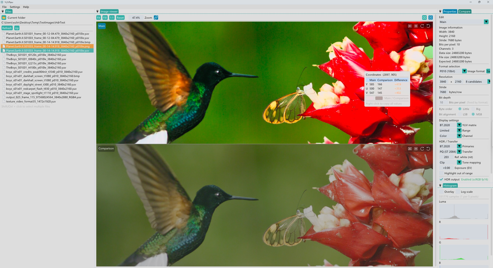

English | [简体中文](README.zh-CN.md)

# YUVRaw

A Windows image viewer for YUV, Bayer RAW, DNG, and everyday image formats. Inspect pixels, compare images, and export results for camera, ISP, and codec debugging.

[Download](https://github.com/bobcatkay/yuvraw-viewer/releases) · [Usage guide](docs/QUICK_START.md) · [Build](#build-from-source) · [Report an issue](https://github.com/bobcatkay/yuvraw-viewer/issues)



## Features

- **Browse and inspect** — Drag and drop images, browse folders, zoom, pan, rotate, and mirror. Inspect pixel values, individual channels, and histograms.
- **Compare images** — Switch between two images, tile them side by side, or view their difference. Check maximum and mean difference, differing-pixel ratio, and PSNR.
- **Configure raw images** — Set format, dimensions, row stride, bit depth, and color interpretation. Save reusable format presets and remember image properties.
- **Preview HDR** — View PQ/HLG images, adjust exposure and tone mapping, and use HDR output on supported Windows displays and drivers.
- **Export and batch convert** — Save PNG, JPEG, BMP, or lossless WebP at original size, a percentage, or a specified width.
- **Customize your workspace** — English and Simplified Chinese, themes, and dockable panels.

## Supported formats

| Type | Formats |
|---|---|
| Standard images | PNG, JPEG, BMP, TIFF, GIF, ICO; WebP, HEIF/HEIC, JXR, and DDS with system codec support |
| RGB / grayscale | RGB8, RGBA8, RGB16, RGBA16, RGB10_A2, Gray8, Gray16 |
| YUV | I420, YV12, YUV422P, YUV444P, NV12, NV21, NV16, YUY2, UYVY, P010, P210, YUV420SP16 |
| Bayer RAW | RGGB, BGGR, GRBG, GBRG; 8/10/12/14/16-bit, including packed RAW10/12/14 |
| DNG | Preview using camera metadata |

Currently displays the **first frame only**. RAW/DNG support is for preview and inspection; exports are 8-bit SDR without transparency. See the [usage guide](docs/QUICK_START.md#format-limitations) for format-specific limits.

## Quick start

Requires **Windows 10 / 11 x64**, an OpenGL 3.3-capable GPU and driver, and the [Microsoft Visual C++ x64 runtime](https://learn.microsoft.com/cpp/windows/latest-supported-vc-redist).

1. Download the Windows ZIP from [Releases](https://github.com/bobcatkay/yuvraw-viewer/releases), extract it in full, and run `YUVRaw.exe`.
2. Drag in an image or press `Ctrl + O`. For headerless `.yuv` / `.raw` files, confirm the format, dimensions, and row stride (**bytes**) in Properties; filename inference provides starting values.
3. To compare, right-click a file in the file browser and add it as the comparison image, then choose a comparison mode.
4. Press `Ctrl + E` to export. For batch export, select files with `Ctrl` / `Shift` in the file browser and use its context menu.

The interface defaults to English. Change it under **Settings → Language** and apply.

| Action | Control |
|---|---|
| Zoom / pan | `Ctrl + wheel` / left-drag |
| Fit to window / 1:1 | `Ctrl + 0` / `Ctrl + 1` |
| Reset view / switch image in single-image comparison | Left double-click / left-click |
| Copy pixel probe information | Right-click a valid image pixel |

You can also open images from the command line (replace the example paths with your own):

```powershell
.\YUVRaw.exe .\frame.yuv --format NV21 --width 1440 --height 1920 --stride 1472
.\YUVRaw.exe .\a.png --compare .\b.png
```

See [all command-line options](docs/BUILDING.md#command-line-options) and [generated sample images](docs/PUBLIC_FIXTURES.md).

## Build from source

Install **Visual Studio 2026** with **Desktop development with C++**, **MSVC v145**, a **Windows SDK**, and the **vcpkg component**, plus Git. Then run in **Developer PowerShell for VS 2026**:

```powershell
git clone https://github.com/bobcatkay/yuvraw-viewer.git
cd yuvraw-viewer
msbuild YUVRaw.sln -p:Configuration=Release -p:Platform=x64 -m:1 -nologo
```

Dependencies are restored automatically; the first build needs internet access. The executable is `x64\Release\YUVRaw.exe`. Alternatively, open `YUVRaw.sln` in Visual Studio, select **Release | x64**, and build the solution.

For Debug builds, custom vcpkg locations, tests, and release packaging, see [Building and testing](docs/BUILDING.md).

## Contributing and license

Bug reports and contributions are welcome. See [Contributing](CONTRIBUTING.md); report security issues via [Security](SECURITY.md). Version changes are listed in [Releases](https://github.com/bobcatkay/yuvraw-viewer/releases).

Licensed under [GPL-3.0-only](LICENSE). See [third-party notices](THIRD_PARTY_NOTICES.md) and [corresponding source](docs/SOURCE_DISTRIBUTION.md) for dependency licenses and source packages.
