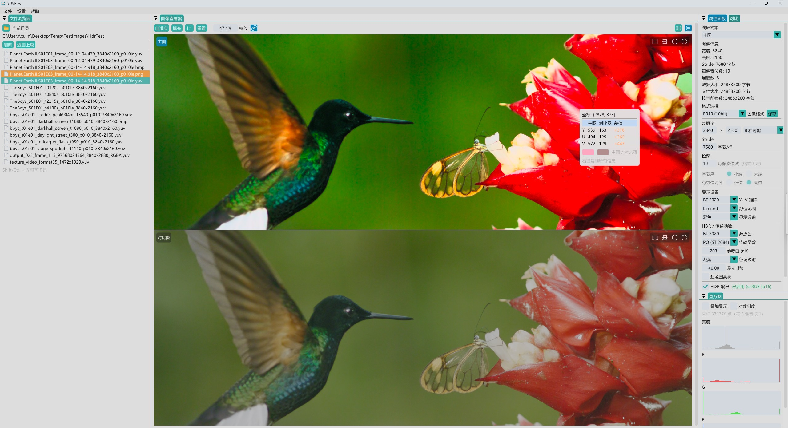

[English](README.md) | 简体中文

# YUVRaw

Windows 图像查看工具，支持 YUV、Bayer RAW、DNG 和常见图片格式。面向相机、ISP 与编解码调试，提供像素检查、图像对比和格式导出。

[下载](https://github.com/bobcatkay/yuvraw-viewer/releases) · [使用指南](docs/QUICK_START.zh-CN.md) · [编译方法](#从源码编译) · [反馈问题](https://github.com/bobcatkay/yuvraw-viewer/issues)



## 功能特性

- **浏览与检查**：拖放打开、目录切图、缩放、平移、旋转和镜像，查看像素值、独立通道与直方图。
- **图像对比**：支持双图切换、并排平铺和差值图，提供最大差、平均差、差异占比及 PSNR 统计。
- **裸图配置**：调整格式、宽高、行跨度、位深和色彩解释，保存常用格式预设，记忆图片属性。
- **HDR 预览**：查看 PQ/HLG 图像，调整曝光与色调映射；显示器和驱动支持时可在 Windows 下输出 HDR。
- **导出与批量转换**：支持 PNG、JPEG、BMP、无损 WebP，可按原尺寸、百分比或指定宽度导出。
- **界面定制**：支持中英文切换、主题设置和可停靠面板。

## 支持格式

| 类型 | 格式 |
|---|---|
| 常规图片 | PNG、JPEG、BMP、TIFF、GIF、ICO；WebP、HEIF/HEIC、JXR、DDS 需系统编解码器支持 |
| RGB / 灰度 | RGB8、RGBA8、RGB16、RGBA16、RGB10_A2、Gray8、Gray16 |
| YUV | I420、YV12、YUV422P、YUV444P、NV12、NV21、NV16、YUY2、UYVY、P010、P210、YUV420SP16 |
| Bayer RAW | RGGB、BGGR、GRBG、GBRG；8/10/12/14/16 bit，含 packed RAW10/12/14 |
| DNG | 使用相机元数据生成预览 |

当前仅显示**首帧**。RAW/DNG 用于预览和检查；导出为不含透明通道的 8 bit SDR 图片。格式相关限制见[使用指南](docs/QUICK_START.zh-CN.md#格式限制)。

## 快速开始

运行环境：**Windows 10 / 11 x64**、支持 OpenGL 3.3 的显卡及驱动，以及 [Microsoft Visual C++ x64 运行库](https://learn.microsoft.com/cpp/windows/latest-supported-vc-redist)。

1. 从 [Releases](https://github.com/bobcatkay/yuvraw-viewer/releases) 下载 Windows ZIP，完整解压后运行 `YUVRaw.exe`。
2. 拖入图片或按 `Ctrl + O` 打开。裸 `.yuv` / `.raw` 文件需在属性面板确认格式、宽高和行跨度（单位为**字节**）；文件名推断结果仅供参考。
3. 需要对比时，在文件浏览器中右键“添加为对比图”，再选择对比模式。
4. 按 `Ctrl + E` 导出当前图；批量导出可在文件浏览器中用 `Ctrl` / `Shift` 多选，再使用右键菜单。

界面默认英文，可在 **Settings → Language（设置 → 语言）** 中选择简体中文并应用。

| 操作 | 按键 / 鼠标 |
|---|---|
| 缩放 / 平移 | `Ctrl + 滚轮` / 左键拖动 |
| 适应窗口 / 1:1 | `Ctrl + 0` / `Ctrl + 1` |
| 重置视图 / 单图对比切换 | 左键双击 / 左键单击 |
| 复制像素探针信息 | 在图像有效像素处右键 |

也可通过命令行打开图片，示例路径请替换为自己的文件：

```powershell
.\YUVRaw.exe .\frame.yuv --format NV21 --width 1440 --height 1920 --stride 1472
.\YUVRaw.exe .\a.png --compare .\b.png
```

更多用法见[完整命令行选项](docs/BUILDING.zh-CN.md#命令行选项)和[合成示例素材](docs/PUBLIC_FIXTURES.zh-CN.md)。

## 从源码编译

安装 **Visual Studio 2026**，勾选 **“使用 C++ 的桌面开发”**、**MSVC v145**、**Windows SDK** 和 **vcpkg 组件**，另需安装 Git。然后在 **Developer PowerShell for VS 2026** 中执行：

```powershell
git clone https://github.com/bobcatkay/yuvraw-viewer.git
cd yuvraw-viewer
msbuild YUVRaw.sln -p:Configuration=Release -p:Platform=x64 -m:1 -nologo
```

首次构建会自动下载依赖，需要联网。产物为 `x64\Release\YUVRaw.exe`。也可用 Visual Studio 打开 `YUVRaw.sln`，选择 **Release | x64** 后生成解决方案。

Debug 构建、自定义 vcpkg 路径、测试和发布打包见[开发与构建](docs/BUILDING.zh-CN.md)。

## 贡献与许可

欢迎反馈问题和提交改进，参与方式见[贡献指南](CONTRIBUTING.zh-CN.md)；安全问题请按[安全说明](SECURITY.zh-CN.md)反馈。版本更新记录见 [Releases](https://github.com/bobcatkay/yuvraw-viewer/releases)。

项目采用 [GPL-3.0-only](LICENSE) 许可。依赖许可与配套源码见[第三方声明](THIRD_PARTY_NOTICES.zh-CN.md)和[源码交付说明](docs/SOURCE_DISTRIBUTION.zh-CN.md)。
